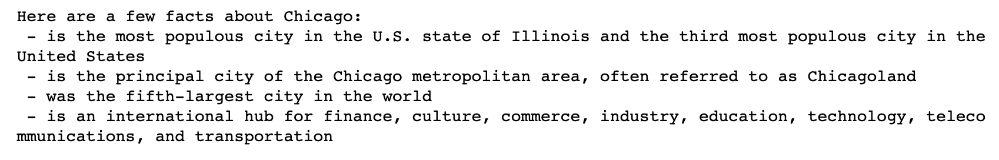
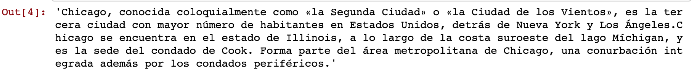
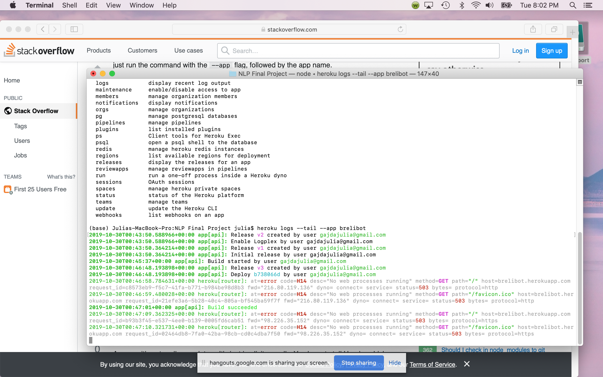

# NLP (Natural Language Processing) 

## Contributors:
* Julia Gajda
* Kathleen Graham
* Tamara Najjar

## Overview: What is Natural Language Processing?
Natural Language Processing (NLP) is a field in Machine Learning that interests us a lot. Formal languages help us communicate with our natural languages in seconds without having to be in the same place. Maybe we've gotten so used to it because Google has made it look easy for quite a while now. We can retrieve information (with autopredictions!) in Google Search. We can filter through spam emails in our Google Mail and extract events to add to our Google Calendar. We can also use the infamous Google Translate instead of just learning that foreign language. We can't forget, we love (and possibly equally hate) auto-correct when texting, and speech recognition features are vital when driving and needing to send a message or to make a call. The list of NLP examples in our lives really could go on and on.

So we set our sights on exploring how we could use NLP in our personal or professional lives. Our initial ideas included the following:
* Extracting Information From Articles On The Web
* Testing NLP in Spanish
* Filtering Spam SMS Messages
* Redacting Sensitive Information From Documents

# Extracting Information From Articles On The Web

## Libraries Used:

* [**Wikipedia**](https://pypi.org/project/wikipedia/#targetText=Project%20description,Wikipedia%20data%2C%20not%20getting%20it.)
* [**spaCy**](https://spacy.io/)   
* [**Textacy**](https://pypi.org/project/textacy/0.3.1/)

## Step-by-Step:

**STEP 1:** Import dependancies.

**STEP 2:** Scrape Chicago Wikipedia page and extract a summary.

```
import wikipedia
chicago_summary = wikipedia.WikipediaPage(title = 'Chicago').summary
chicago_summary = chicago_summary.replace('\n','').replace("\'","")
chicago_summary
```

**STEP 3:** Load English NLP model.

```
import spacy
import textacy.extract
nlp = spacy.load('en_core_web_lg')
```

**STEP 4:** Specify the text that's being used and use spaCy to parse through the text.

```
text = chicago_summary
doc = nlp(text)
```

**STEP 5:** Extract structured sentences.

```
statements = textacy.extract.semistructured_statements(doc, "Chicago")
```

**STEP 6:** Print fact summary.

```
print("Here are a few facts about Chicago:")

for statement in statements:
    subject, verb, fact = statement
    print(f" - {verb} {fact}")
```


## Final Summary:

As you can see, we were able to scan the entire Wikipedia page and extract a concise summary (above).


# Testing NLP in Spanish

## Libraries Used:

* [**Wikipedia**](https://pypi.org/project/wikipedia/#targetText=Project%20description,Wikipedia%20data%2C%20not%20getting%20it.)
* [**spaCy**](https://spacy.io/) 
* [**Textacy**](https://pypi.org/project/textacy/0.3.1/)
* [**Requests**](https://realpython.com/python-requests/)


## Step-by-Step:

**STEP 1:** Import dependancies.

**STEP 2:** Set language to Spanish then scrape Chicago Wikipedia page and extract a summary.

```
wikipedia.set_lang('es')
summary = wikipedia.summary('Chicago')
summary = summary.replace('\n','').replace("\'","").replace("[1]","").replace("[2]","").replace("[3]","").replace("[4]","").replace("[5]","").replace("[6]","").replace("[7]","").replace("\u200b","")
summary
```




**STEP 3:** Load Spanish NLP model.

```
import spacy
import textacy.extract
nlp = spacy.load('es_core_web_lg')
```

**STEP 4:** Specify the text that's being used and use spaCy to parse through the text.

```
text = chicago_summary
doc = nlp(text)
```

**STEP 5:** Extract structured sentences.

```
statements = textacy.extract.semistructured_statements(doc, "Chicago")
```

**STEP 6:** Print fact summary.

```
print("Here are a few facts about Chicago:")

for statement in statements:
    subject, verb, fact = statement
    print(f" - {verb} {fact}")
```

## Final Summary: 

While we were able to get a summary to print in Spanish in STEP 2, we were unable to do so in STEP 6. 

# Filtering Spam SMS Messages

## Libraries Used:

* [**Numpy**](https://numpy.org/)
* [**Pandas**](https://www.tutorialspoint.com/python_pandas/index.htm)
* [**Matplotlib**](https://matplotlib.org/)
* [**Seaborn**](https://seaborn.pydata.org/)
* [**Warnings**](https://www.tutorialspoint.com/warning-control-in-python-programs)
* [**NLTK**](https://www.nltk.org/)
* [**Stopwords**](https://pythonspot.com/nltk-stop-words/)
* [**spaCy**](https://spacy.io/)
* [**Sklearn**](https://machinelearningmastery.com/a-gentle-introduction-to-scikit-learn-a-python-machine-learning-library/)

## Step-by-Step:

**STEP 1:** Import dependancies including **nltk.download("all")** which will download all NLTK sub-libraries.


**STEP 2:** Read in CSV that contains examples of spam text messages.

```
messages = pd.read_csv("spam.csv", encoding = 'latin-1')
```

**STEP 3:** Clean-up dataframe.

```
messages = messages.drop(labels = ["Unnamed: 2", "Unnamed: 3", "Unnamed: 4"], axis = 1)
messages.columns = ["category", "text"]
```


# Redacting Sensitive Information From Documents

## Libraries Used:

* placeholder
* placeholder

# BONUS: Building A Chatbot

## Libraries Used:

* [**Celery**](http://www.celeryproject.org/)
* [**OS**](https://www.pythonforbeginners.com/os/pythons-os-module)
* [**JSON**](https://www.w3schools.com/python/python_json.asp)
* [**Sys**](https://www.tutorialsteacher.com/python/sys-module)
* [**Requests**](https://realpython.com/python-requests/)

## Sources to Reference When Starting:
* https://moz.com/blog/chat-bot
* https://botwiki.org/
* https://chatbotslife.com/


## Step-by-Step:
**STEP 1:** Design.
   * Conversation flow(diagraming helps)use best practices.
   
**STEP 2:** Build & Test.
   * Create a conversation in Dialogflow
       * Create an agent
       * Recognize intents (questions)
       * Trigger right response (answers)
       * Test/Train to validate

**STEP 3:** Integrate external code (Python & Json docs).

**STEP 4:** Deploy to Heroku.

**Our Intents:**

* What is NLP? What does NLP do?
* What is spacy? What does spacey do?
* What is textacy? What does textacy do?

**Final Notes:**

Bots take a long time to build and we were able to get as far as we did with our bot thanks to sources mentioned above which were willing to share their code and process that took months of research and testing. We ran out of time but plan to continue toruble-shooting until we are able to sucessfully deploy ‘Brelibot’.




