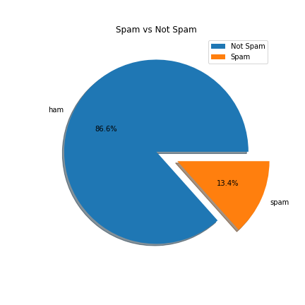
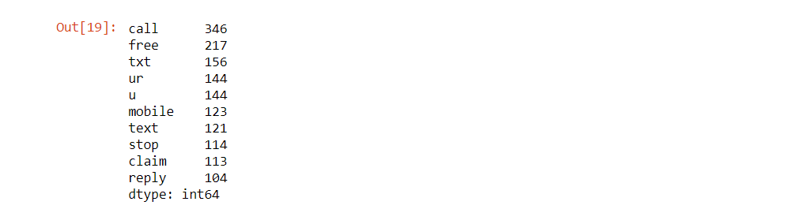
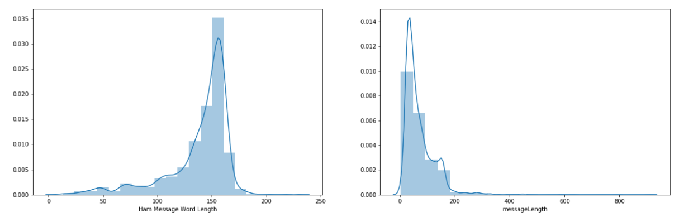

# NLP (Natural Language Processing) 

## Contributors:
* Julia Gajda
* Kathleen Graham
* Tamara Najjar

## Overview: What is Natural Language Processing?
Natural Language Processing (NLP) is a field in Machine Learning that interests us a lot. Formal languages help us communicate with our natural languages in seconds without having to be in the same place. Maybe we've gotten so used to it because Google has made it look easy for quite a while now. We can retrieve information (with autopredictions!) in Google Search. We can filter through spam emails in our Google Mail and extract events to add to our Google Calendar. We can also use the infamous Google Translate instead of just learning that foreign language. We can't forget, we love (and possibly equally hate) auto-correct when texting, and speech recognition features are vital when driving and needing to send a message or to make a call. The list of NLP examples in our lives really could go on and on.

So we set our sights on exploring how we could use NLP in our personal or professional lives. Our initial ideas included the following:
* Extracting Information From Articles On The Web
* Testing NLP in Spanish
* Filtering Spam SMS Messages
* Redacting Sensitive Information From Documents

After exploring these different avenues, we decided to try making a chatbot. A lot of research showed that this involved lots of time and many steps, but we all agreed it would be an interesting learning experiment! We were happy to include as bonus natural language processing section to this project, and we're definitely planning to continue building our chatbot to officially deploy in the future.

# Extracting Information From Articles On The Web

## Libraries Used:

* [**Wikipedia**](https://pypi.org/project/wikipedia/#targetText=Project%20description,Wikipedia%20data%2C%20not%20getting%20it.)
* [**spaCy**](https://spacy.io/)   
* [**Textacy**](https://pypi.org/project/textacy/0.3.1/)

## Step-by-Step:

**STEP 1:** Import dependancies.

```python
import wikipedia
import spacy
import textacy.extract
```

**STEP 2:** Scrape Chicago Wikipedia page and extract a summary.

```python
chicago_summary = wikipedia.WikipediaPage(title = 'Chicago').summary
chicago_summary = chicago_summary.replace('\n','').replace("\'","")
chicago_summary
```

**STEP 3:** Load English NLP model.

```python
nlp = spacy.load('en_core_web_lg')
```

**STEP 4:** Specify the text that's being used and use spaCy to parse through the text.

```python
text = chicago_summary
doc = nlp(text)
```

**STEP 5:** Extract structured sentences.

```python
statements = textacy.extract.semistructured_statements(doc, "Chicago")
```

**STEP 6:** Print fact summary.

```python
print("Here are a few facts about Chicago:")

for statement in statements:
    subject, verb, fact = statement
    print(f" - {verb} {fact}")
```


## Final Summary:

As you can see, we were able to scan the entire Wikipedia page and extract a concise summary of facts about Chicago (above).


# Testing NLP in Spanish

## Libraries Used:

* [**Wikipedia**](https://pypi.org/project/wikipedia/#targetText=Project%20description,Wikipedia%20data%2C%20not%20getting%20it.)
* [**spaCy**](https://spacy.io/) 
* [**Textacy**](https://pypi.org/project/textacy/0.3.1/)
* [**Requests**](https://realpython.com/python-requests/)


## Step-by-Step:

**STEP 1:** Import dependancies.

```python
import spacy
import textacy.extract
```

**STEP 2:** Set language to Spanish then scrape Chicago Wikipedia page and extract a summary.

```python
wikipedia.set_lang('es')
summary = wikipedia.summary('Chicago')
summary = summary.replace('\n','').replace("\'","").replace("[1]","").replace("[2]","").replace("[3]","").replace("[4]","").replace("[5]","").replace("[6]","").replace("[7]","").replace("\u200b","")
summary
```


**STEP 3:** Load Spanish NLP model.

```python
nlp = spacy.load('es_core_web_lg')
```

**STEP 4:** Specify the text that's being used, use spaCy to parse through the text, and extract more structured sentences.

```python
text = chicago_summary
doc = nlp(text)
statements = textacy.extract.semistructured_statements(doc, "Chicago")
```

**STEP 5:** Print fact summary.

```python
print("Here are a few facts about Chicago:")

for statement in statements:
    subject, verb, fact = statement
    print(f" - {verb} {fact}")
```

## Final Summary: 

Unfortunately, we weren't able to get the final extraction to print in Spanish. While we were able to get a summary to print in Spanish in STEP 2, we were unable to do so with facts in STEP 6. We tested a bunch of different articles and text from other documents, but ultimately could not get any text extraction in Spanish. 

After exploring more documentation from MediaWiki and the Wikipedia API, we determined that the issue is most likely not anything to do with the intial request to Wikipedia. We believe it could be due to the Spanish model in Spacy not being as extensive as the one for the English language. We decided to continuing other topics in Natural Language Processing and come back to the Spanish model later. 

# Filtering Spam SMS Messages

## Libraries Used:

* [**Numpy**](https://numpy.org/)
* [**Pandas**](https://www.tutorialspoint.com/python_pandas/index.htm)
* [**Matplotlib**](https://matplotlib.org/)
* [**Seaborn**](https://seaborn.pydata.org/)
* [**NLTK**](https://www.nltk.org/)
* [**Stopwords**](https://pythonspot.com/nltk-stop-words/)
* [**spaCy**](https://spacy.io/)
* [**Sklearn**](https://machinelearningmastery.com/a-gentle-introduction-to-scikit-learn-a-python-machine-learning-library/)

## Step-by-Step:

**STEP 1:** Import dependancies including **nltk.download("all")** which will download all NLTK sub-libraries.


**STEP 2:** Read in CSV that contains examples of spam text messages.

**STEP 3:** Clean-up dataframe and observe the information.

```python
messages = messages.drop(labels = ["Unnamed: 2", "Unnamed: 3", "Unnamed: 4"], axis = 1)
messages.columns = ["category", "text"]
```

**STEP 4:** Observe percentage of spam through plotting.

```python
# plot spam percentage
messages["category"].value_counts().plot(kind='pie', explode=[0, 0.25], figsize=(6, 6), autopct='%1.1f%%', shadow=True)
plt.title("Spam vs Not Spam")
plt.ylabel('')
plt.legend(["Not Spam", "Spam"])
plt.savefig('spamvsnotspam_piechart.png')
plt.show()
```



**STEP 5:** Extract spam words to find most common.

```python
spam_messages = messages[messages["category"] == "spam"]["text"]
spam_words = []

def extractSpamWords(spamMessages):
    global spam_words
    words = [word.lower() for word in word_tokenize(spamMessages) if word.lower() not in stopwords.words("english") and word.lower().isalpha()]
    spam_words = spam_words + words

spam_messages.apply(extractSpamWords)

spam_words = np.array(spam_words)
print("Top 10 Spam words are:\n")
pd.Series(spam_words).value_counts().head(n = 10)
```



**STEP 6:** Make a word cloud of spam words.

```python
from wordcloud import WordCloud

spam_wordcloud = WordCloud(width=500, height=500).generate(" ".join(spam_words))
plt.figure(figsize=(10,8))
plt.imshow(spam_wordcloud)
plt.axis("off") # this allows us to hide the x and y axis
plt.tight_layout(pad=0)
plt.savefig('spam_wordcloud.png', bbox_inches='tight')

plt.show()
```


**STEP 7:** Observe count of message word length of both spam and non-spam messages.

```python
messages["messageLength"] = messages["text"].apply(len)
messages["messageLength"].describe()

import seaborn as sns
f, ax = plt.subplots(1, 2, figsize = (20, 6))
sns.distplot(messages[messages["category"]=="spam"]["messageLength"], bins=20, ax=ax[0])
ax[0].set_xlabel("Spam Message Word Length")
sns.distplot(messages[messages["category"]=="ham"]["messageLength"], bins=20, ax=ax[1])
ax[0].set_xlabel("Ham Message Word Length")
plt.show()
```



## Final Summary: 

As usual, we set out to filter spam email messages and couldn't get good enough data. But there was a lot of information about spam SMS messages, so we decided to try to use that instead.

These are just the main steps we took when filtering spam and observing anything insightful from this. About 86% of our dataset is not spam. That's a lot of perfectly normal messages! This makes us think that there might need to be a better dataset to for training. We researched a little bit about needing to use stratified sampling to avoid it being skewed towards normal messages. But the most important thing to remember when using natural language processing for spam is to be accurate so that non-spam messages don't get placed into spam regularly. That is a pain and leaves a lot to be fixed!

# Redacting Sensitive Information From Documents

## Libraries Used:

* [**spaCy**](https://spacy.io/)

## Step-by-Step

**STEP 1:** Determine that names should be redacted.
```python
def replace_name_with_placeholder(token):
    if token.ent_iob != 0 and token.ent_type_ == "PERSON":
        return "[REDACTED] "
    else:
        return token.string
```

**STEP 2:** Check which words are names to be redacted.
```python
def scrub(text):
    doc = nlp(text)
    for ent in doc.ents:
        ent.merge()
    tokens = map(replace_name_with_placeholder, doc)
    return "".join(tokens)
```

## Final Summary: 

We found redaction to be the simplest of all our initial projects. We feel this can be tailored in the future to account for documents that have a lot of names but not all names need to be redacted.

# BONUS: Building A Chatbot

## Libraries Used:

* [**Celery**](http://www.celeryproject.org/)
* [**OS**](https://www.pythonforbeginners.com/os/pythons-os-module)
* [**JSON**](https://www.w3schools.com/python/python_json.asp)
* [**Sys**](https://www.tutorialsteacher.com/python/sys-module)
* [**Requests**](https://realpython.com/python-requests/)

## Sources to Reference When Starting:
* https://moz.com/blog/chat-bot
* https://botwiki.org/
* https://chatbotslife.com/


## Step-by-Step:
**STEP 1:** Design.
   * Conversation flow(diagraming helps)use best practices.
   
**STEP 2:** Build & Test.
   * Create a conversation in Dialogflow
       * Create an agent
       * Recognize intents (questions)
       * Trigger right response (answers)
       * Test/Train to validate

**STEP 3:** Integrate external code (Python & Json docs).

**STEP 4:** Deploy to Heroku.

**Our Intents:**

* What is NLP? What does NLP do?
* What is spacy? What does spacey do?
* What is textacy? What does textacy do?

**Final Notes:**

Bots take a long time to build and we were able to get as far as we did with our bot thanks to sources mentioned above which were willing to share their code and process that took months of research and testing. We ran out of time but plan to continue toruble-shooting until we are able to sucessfully deploy ‘Brelibot’.


